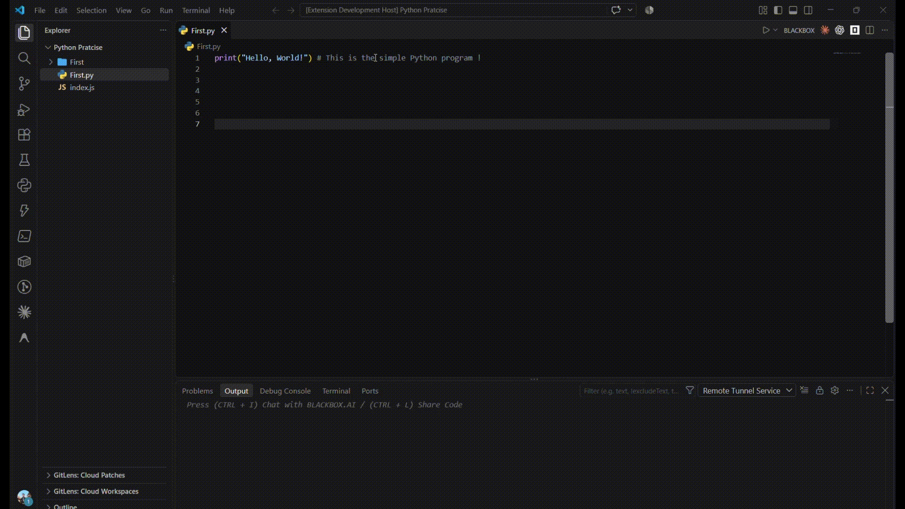

# Comment Highlighter

Highlight important text inside code comments directly in Visual Studio Code.

Code comments often hold TODOs, warnings, explanations, and references. Comment Highlighter makes the parts that matter stand out, so you can spot them at a glance while you work.

## Features

- Highlight selected text inside a comment with a background color
- Remove a highlight from a selection, or clear all highlights at once
- Customize the highlight color in settings
- Works with line comments in 30+ programming languages
- Only highlights comment content, never your code

## Usage

1. Open a file that contains comments.
2. Select text **inside a comment**. For example, in `// TODO: Fix this bug`, select `Fix this bug`.
3. Press `Ctrl+Alt+H` (Windows/Linux) or `Cmd+Alt+H` (macOS).

The selected text is highlighted. You can also run **Highlight Comment** from the Command Palette (`Ctrl+Shift+P` / `Cmd+Shift+P`).

### Removing highlights

- Select highlighted text and press `Ctrl+Alt+Shift+H` (`Cmd+Alt+Shift+H` on macOS) to remove that highlight.
- Press the same shortcut with no selection to remove all highlights.

## Example



## Commands

| Command | Shortcut (Windows/Linux) | Shortcut (macOS) | Description |
|---|---|---|---|
| Highlight Comment | `Ctrl+Alt+H` | `Cmd+Alt+H` | Highlight the selected comment text |
| Remove Highlight | `Ctrl+Alt+Shift+H` | `Cmd+Alt+Shift+H` | Remove the selected highlight, or all highlights if nothing is selected |

## Settings

| Setting | Default | Description |
|---|---|---|
| `commentHighlighter.highlightColor` | `#ffff00` | Background color used for highlights |

Example `settings.json`:

```json
{
  "commentHighlighter.highlightColor": "#ffff00"
}
```

You can also open **Settings** and search for "Comment Highlighter".

## Supported Languages

| Language | Comment token |
|---|---|
| JavaScript, TypeScript, Java, C, C++, C#, Go, Rust, PHP | `//` |
| Python, Ruby, Shell, YAML | `#` |
| SQL | `--` |
| HTML, XML, Markdown | `<!-- -->` |
| CSS, SCSS, Less | `/* */` or `//` |

Other languages that use these comment styles are supported as well.

## Requirements

Visual Studio Code 1.xx or later.

## Issues and Feedback

Found a bug or have a feature request? Please open an issue on the [GitHub repository](https://github.com/your-username/comment-highlighter/issues).

## License

[MIT](LICENSE)